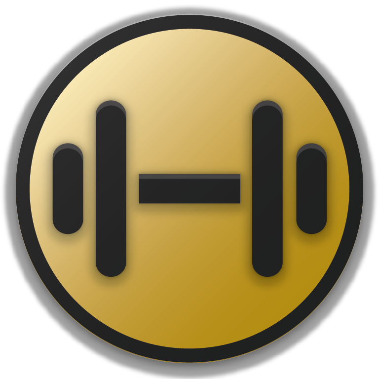

# Personal Trainer
> A program whose purpose is to support powerlifting training. It is written for phones with Android system.

  

## Used
+ [Firebase](https://firebase.google.com/) - database, authentication
+ [Lombok](https://projectlombok.org/) - some useful annotations 
+ [androidannotations](https://github.com/androidannotations) - even more useful annotations 
+ [Material Design](https://material.io/develop/android/) - CoordinatorLayout, Toolbars, TextInputLayout
+ [BottomNavigationViewEx](https://github.com/ittianyu/BottomNavigationViewEx) - to change the look of bottom navigation bar
+ [Universal Image Loader](https://github.com/nostra13/Android-Universal-Image-Loader) - to load images
+ [CircleImageView](https://github.com/hdodenhof/CircleImageView) - to crop profile images to a circle
